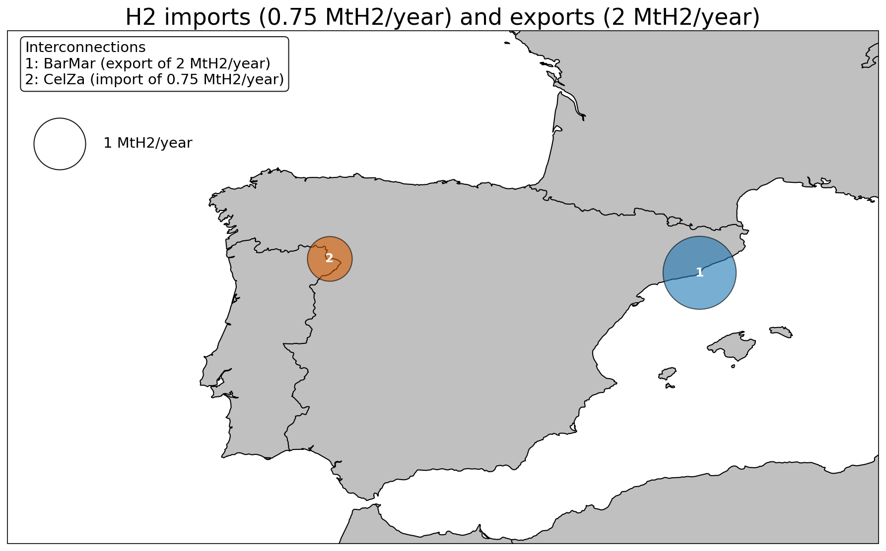

..
  SPDX-FileCopyrightText: 2019-2024 The PyPSA-Spain Authors

  SPDX-License-Identifier: CC-BY-4.0

####################################################################
The model for H2 imports and exports
####################################################################

PyPSA-Spain includes a functionality to model hydrogen imports and exports through cross-border points. Each import/export point represents a fixed annual amount of hydrogen flowing in or out of the Spanish system at a given geographical location, typically associated with a planned or existing transboundary H2 infrastructure (e.g. a pipeline corridor).

The required elements are added during the rule `prepare_sector_network`, after the regular sector-coupled network has been built. The configuration relies on two groups of elements: a YAML file describing the cross-border points, and a corresponding entry in the ``pypsa_spain`` module of the configuration file.

Model components
========================

For each cross-border point, the following elements are added to the network:

- a **border H2 bus** with carrier ``H2_ic`` and unit ``MWh_LHV``, located at the user-specified coordinates.
- if the point represents an **import**: a must-run **generator** at the border bus, producing a constant power output such that the total annual production equals the configured amount of hydrogen.
- if the point represents an **export**: a fixed **load** at the border bus, consuming a constant power such that the total annual consumption equals the configured amount of hydrogen.
- a **link** between the border bus and the closest H2 bus of the Spanish network. The direction of the link reflects the flow direction (border → network for imports, network → border for exports). The link uses carrier ``H2_ic import`` or ``H2_ic export`` accordingly.

The closest H2 bus is identified at runtime based on Euclidean distance between the border coordinates and the buses in peninsular Spain.

The annual hydrogen amount is converted to a constant power setpoint using:

.. math::

   p = \frac{\text{annual\_amount} \cdot 33.33 \times 10^6}{\sum_t w_t} \quad [\text{MW}]

where :math:`33.33 \times 10^6` MWh is the lower heating value of one million tonnes of H2, and :math:`\sum_t w_t` is the total weight of the snapshots (equal to 8760 hours for full-year runs at any temporal resolution).

The must-run behaviour of the generator is enforced through ``p_min_pu = p_max_pu = 1`` and ``p_nom = p``. The constant load is imposed by directly setting ``loads_t.p_set`` for the load.

Configuration
========================

The functionality is enabled in the ``pypsa_spain`` module of ``config/config_ES.yaml``:

.. code-block:: yaml

   H2_imports_exports:
     enable: true
     file: data_ES/H2/H2_imports_exports.yaml

The characteristics of each cross-border point are defined in the file referenced above. Two example points are provided by default:

- **CelZa** (import): a 0.75 MtH2/year hydrogen pipeline import from Portugal at the Iberian border (Zamora area).
- **BarMar** (export): a 2 MtH2/year hydrogen pipeline export to France through the Mediterranean corridor (Barcelona area).

Modelling assumptions and limitations
========================================

The current implementation deliberately abstracts away physical losses on the border-to-network link:

- The link uses ``efficiency = 1`` and is not subject to the compression losses applied to internal H2 pipelines (which act on the carrier ``H2 pipeline``).
- The link capacity is fixed (``p_nom_extendable = False``) and equal to the constant power required to satisfy the annual amount, ensuring the link never becomes a binding constraint.

