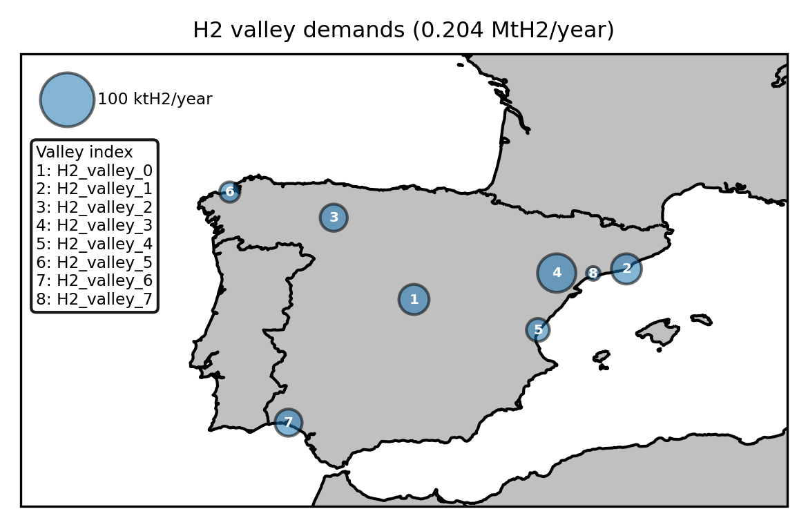

..
  SPDX-FileCopyrightText: 2019-2024 The PyPSA-Spain Authors

  SPDX-License-Identifier: CC-BY-4.0

####################################################################
The model for H2 valley demands
####################################################################

PyPSA-Spain includes a functionality to model geolocalised annual hydrogen demands associated with so-called H2 valleys (clusters of industrial, mobility or sectoral H2 consumers planned at a given location). Each H2 valley represents a fixed annual amount of hydrogen consumed inside the Spanish system at a given geographical location, which the model then distributes as a constant load over the whole year.

The required elements are added during the rule ``prepare_sector_network``, after the regular sector-coupled network has been built. The configuration relies on two groups of elements: a YAML file describing the H2 valleys, and a corresponding entry in the ``pypsa_spain`` module of the configuration file.

Model components
========================

For each H2 valley, the following element is added to the network:

- a **fixed H2 load** with carrier ``H2``, attached to the closest H2 bus of the Spanish network and consuming a constant power such that the total annual consumption equals the configured amount of hydrogen.

The closest H2 bus is identified at runtime based on Euclidean distance between the H2 valley coordinates and the H2 buses in peninsular Spain.

The annual hydrogen amount is converted to a constant power setpoint using:

.. math::

   p = \frac{\text{annual\_amount} \cdot 33.33 \times 10^6}{\sum_t w_t} \quad [\text{MW}]

where :math:`33.33 \times 10^6` MWh is the lower heating value of one million tonnes of H2, and :math:`\sum_t w_t` is the total weight of the snapshots (equal to 8760 hours for full-year runs at any temporal resolution).

The constant load is imposed by directly setting ``loads_t.p_set`` for the load.

Configuration
========================

The functionality is enabled in the ``pypsa_spain`` module of ``config/config_ES.yaml``:

.. code-block:: yaml

   H2_valley_demands:
     enable: true
     file: data_ES/H2/H2_valley_demands.yaml

The characteristics of each H2 valley are defined in the file referenced above. Each entry specifies the valley coordinates (``x``, ``y``) and the annual hydrogen demand in MtH2/year. The ``bus`` field of the load is left empty in the YAML file and assigned at runtime to the closest H2 bus on the Spanish network.

.. note::

   When this functionality is enabled, the electricity demand associated with H2 production should be removed from the regular electricity demand input to avoid double counting.

The following figure shows the H2 valleys defined in the template file included in the repository. A more detailed description of these example valleys is provided in `PR #18 <https://github.com/cristobal-GC/pypsa-spain/pull/18>`__.

Modelling assumptions and limitations
========================================

The current implementation deliberately makes some simplifications:

- The H2 demand of each valley is imposed as a **constant load** over all snapshots. Intra-annual variability of the demand is not represented.
- Each valley is attached to a **single H2 bus**, identified as the closest one by Euclidean distance. The internal hydrogen distribution network within the valley is not modelled.
- The annual amount is treated as **exogenous**: it is not co-optimised with the rest of the system.
