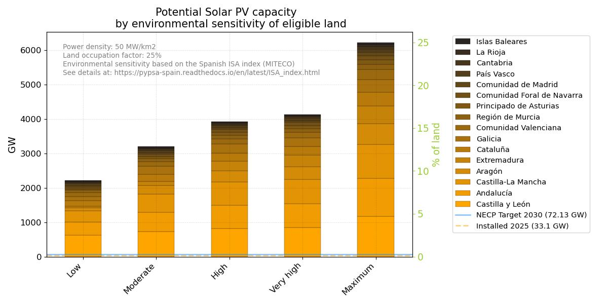

..
  SPDX-FileCopyrightText: 2019-2024 The PyPSA-Spain Authors

  SPDX-License-Identifier: CC-BY-4.0

The Spanish Environmental Sensitivity Index (ISA)
=======================================================================================

In 2020, the Ministry for Ecological Transition and the Demographic Challenge (MITECO) created a tool for identifying areas across the national territory that present significant environmental constraints for the installation of wind farms and photovoltaic plants. This was achieved through a territorial model that produces environmental sensitivity zoning, aiming to facilitate decision-making and public participation from the early stages of authorization.

The methodology relies on multi-criteria evaluation techniques using Geographic Information Systems (GIS) and a comprehensive analysis of documentation and legislation. It includes indicators at the following levels:

- Urban areas
- Water bodies and flood zones
- Plans for threatened species
- Protection areas for birds against collision and electrocution on high voltage power lines
- Ecological connectivity and wild highways
- Important Bird and Biodiversity Conservation Areas in Spain
- Habitats of Community interest
- Natura 2000 sites (ZEPA, LIC and ZEC)
- Protected Natural Areas
- RAMSAR wetlands
- Specially Protected Areas of Mediterranean Importance
- Biosphere Reserves
- Sites of Geological Interest
- Visibility
- the Camino de Santiago
- traditional livestock routes
- Public Utility Forests
- UNESCO World Heritage sites

As a result, an **Environmental Sensitivity Index (ISA)** was calculated for each 25x25 meter pixel across the territory, and for each energy type (wind power and solar PV). Five levels were defined:

.. csv-table::
   :header-rows: 1
   :widths: 22,7,22,33
   :file: configtables/ISA_index.csv

See more details on the ISA index `here <https://www.miteco.gob.es/en/calidad-y-evaluacion-ambiental/temas/evaluacion-ambiental/zonificacion_ambiental_energias_renovables.html>`__ (in Spanish).

PyPSA-Spain allows land elegibility to be defined according to the ISA index (see `config <https://pypsa-spain.readthedocs.io/en/latest/configuration.html>`__.

The following figures show the potential capacity in Spain according to different ISA levels and NUTS 2 regions. For example, *High* means that eligible land includes ISA levels 2, 3 and 4. Horizontal lines indicate the installed capacity of the corresponding technology in 2025, and the target for 2030 as defined in the Spanish National Energy and Climate Plan (NECP). Energy densities of 10 MW/km2 and 50 MW/km2 were assumed for wind power and solar PV, respectively. A land occupation factor of 25% was assumed, meaning that only this percentage of eligible land was considered when determining the potential capacity.

    
    

.. toctree::
   :hidden:
   :maxdepth: 1
   :caption: Getting Started

   configuration
   release_notes
