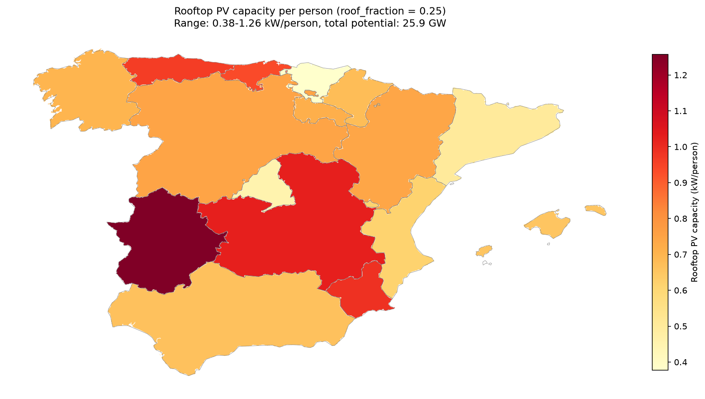

..
  SPDX-FileCopyrightText: 2019-2024 The PyPSA-Spain Authors

  SPDX-License-Identifier: CC-BY-4.0

####################################################################
Solar rooftop potential
####################################################################

PyPSA-Spain provides regional values of the rooftop PV capacity per person, used to set the maximum potential of the ``solar rooftop`` generators in the sector-coupled model.

The default PyPSA-Eur procedure (rule ``build_solar_rooftop_potentials``) assumes a single value for all regions: 0.1 kW/m² and 20 m² of roof per person, i.e. 2 kW/person. The potential of each clustered region is this value multiplied by its population.

PyPSA-Spain replaces this homogeneous value with estimates for each Spanish autonomous community (NUTS2), derived from average residential buildings in each region and the corresponding optimal self-consumption installations computed in Gallego-Castillo, C., Heleno, M., Victoria, M. (2021), *Self-consumption for energy communities in Spain: A regional analysis under the new legal framework*, Energy Policy 150, 112144 (`doi:10.1016/j.enpol.2021.112144 <https://doi.org/10.1016/j.enpol.2021.112144>`_, preprint `arXiv:2006.06459 <https://arxiv.org/abs/2006.06459>`_).

Data
========================

The values are stored in ``data_ES/solar_rooftop/rooftop_pv_kw_per_person_nuts2.csv``, for 17 NUTS2 regions and for Spain as a whole (``ES``). The methodology is described in detail in ``data_ES/solar_rooftop/README.md``.

In short, the estimates start from the average residential building of each region (households per building and roof area, from the 2011 Population and Housing Census). For this building, the paper gives the optimal PV capacity per household and the share of the roof it occupies. Capacity per household is converted to capacity per person by dividing by the average household size of each region (INE, `table 60132 <https://www.ine.es/jaxiT3/Tabla.htm?t=60132>`_).

Three scenarios are provided:

.. list-table::
   :header-rows: 1
   :widths: 25 35 40

   * - ``scenario``
     - Column
     - Description
   * - ``roof_fraction``
     - ``kw_per_person_full_roof`` × ``roof_fraction``
     - PV covering a fraction ``roof_fraction`` of the average building roof. The data file gives the value for 100% of the roof, which is a physical upper bound, not a realistic potential.
   * - ``without_surplus_remuneration``
     - ``kw_per_person_opt_no_surplus_remuneration``
     - Optimal installation when surplus energy fed into the grid is not remunerated. Sized to cover on-site consumption only.
   * - ``with_surplus_remuneration``
     - ``kw_per_person_opt_surplus_remuneration``
     - Optimal installation when surplus energy is remunerated under the Spanish simplified compensation scheme (RD 244/2019).

Configuration
========================

The functionality is enabled in the ``pypsa_spain`` module of ``config/config_ES.yaml``:

.. code-block:: yaml

   solar_rooftop:
     enable: true
     scenario: roof_fraction
     roof_fraction: 0.25

The ``scenario`` parameter selects the column of the data file, see the table above. Valid options are ``roof_fraction``, ``without_surplus_remuneration`` and ``with_surplus_remuneration``.

The ``roof_fraction`` parameter is only used with ``scenario: roof_fraction``. It sets the fraction of the average building roof covered by PV, and must be in (0, 1]. According to Gallego-Castillo et al. (2021), roof shares above about 50% are unlikely in practice.

When ``enable: false``, the PyPSA-Eur default value (2 kW/person) is used for all regions.

Diagnostic plots
========================

The rule also produces a control map, ``map_kw_per_person.png``, under ``resources/{PREFIX}/{NAME}/solar_rooftop/``. It shows the clustered regions of the Iberian Peninsula and the Balearic Islands coloured by their kW/person value, with the NUTS2 boundaries overlaid. The title reports the scenario, the range of kW/person values and the total potential.

The figure below shows the control map for ``scenario: roof_fraction`` with ``roof_fraction: 0.25``.

Modelling assumptions and limitations
========================================

- Only residential buildings are considered. Commercial and industrial roofs are excluded.
- The full roof values, on which the ``roof_fraction`` scenario is based, do not deduct shading, obstacles, orientation or structural limits. The ``roof_fraction`` parameter can be used to account for them.
- Building data are from 2011, while household size is from 2026.
- The kW/person value is assumed to be homogeneous within each NUTS2 region, and the weighting for clustered regions uses areas, not population.
